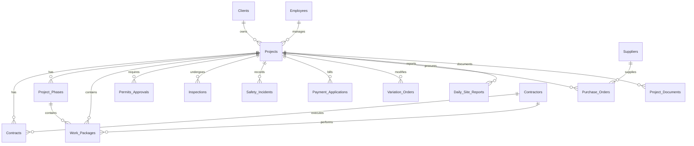

# Dubai ERP — Enterprise Architecture Documentation

## System Overview

Production-grade data governance and automation engine for civil project management operations. Designed for Google Sheets with Apps Script automation.

### Architecture Layers

```
┌─────────────────────────────────────────────────────┐
│              Google Sheets UI Layer                  │
│  (Conditional Formatting, Privacy Shading, Menus)   │
├─────────────────────────────────────────────────────┤
│           ERP Automation Engine (Apps Script)        │
│  Triggers │ Validation │ Tagging │ Derived Metrics  │
├─────────────────────────────────────────────────────┤
│              Import Engine (Apps Script)             │
│  Schema Validation │ Upsert │ FK Validation         │
├─────────────────────────────────────────────────────┤
│           Data Generation Layer (Python)             │
│  17 Tables │ Referential Integrity │ Smart Tags     │
├─────────────────────────────────────────────────────┤
│                CSV Data Storage                      │
│  GitHub Repository → Raw Content URLs               │
└─────────────────────────────────────────────────────┘
```

---

## Data Model (17 Tables, 3NF Normalized)

### Entity Relationship Diagram



### Master Tables (No FK Dependencies)
| Table | PK | Records | Key Fields |
|-------|-----|---------|------------|
| Clients | `client_id` (CL-XXX) | 50 | name, type, status, lifetime_revenue, risk_projects |
| Employees | `employee_id` (EMP-XXXX) | 130 | name, dept, designation, salary_aed |
| Contractors | `contractor_id` (CON-XXX) | 100 | company, specialty, rating |
| Suppliers | `supplier_id` (SUP-XXX) | 80 | company, category, approved |
| Equipment | `equipment_id` (EQ-XXXX) | 150 | type, model, daily_rate |

### Transaction Tables (FK Dependencies)
| Table | PK | FK(s) | Records |
|-------|-----|-------|---------|
| Projects | `project_id` | client_id → Clients, project_manager_id → Employees | 100 |
| Contracts | `contract_id` | project_id → Projects, contractor_id → Contractors | 676 |
| Project_Phases | `phase_id` | project_id → Projects | 1,000 |
| Work_Packages | `package_id` | project_id → Projects, phase_id → Phases, contractor_id → Contractors | 1,175 |
| Permits_Approvals | `permit_id` | project_id → Projects | 591 |
| Inspections | `inspection_id` | project_id → Projects, inspector_id → Employees | 4,118 |
| Safety_Incidents | `incident_id` | project_id → Projects | 678 |
| Payment_Applications | `ipc_id` | project_id → Projects, contract_id → Contracts | 854 |
| Variation_Orders | `vo_id` | project_id → Projects | 521 |
| Purchase_Orders | `po_id` | project_id → Projects, vendor_id → Suppliers/Contractors | 2,767 |
| Daily_Site_Reports | `report_id` | project_id → Projects, prepared_by → Employees | 2,340 |
| Project_Documents | `document_id` | project_id → Projects | 13,781 |

### ERP Governance Columns (ALL Tables)
| Column | Type | Purpose |
|--------|------|---------|
| `created_at` | ISO timestamp | Record creation time |
| `last_updated_at` | ISO timestamp | Last modification time |
| `created_by` | Email | Record creator |
| `record_version` | Integer | Change counter (starts at 1) |
| `is_active` | Boolean | Soft-delete flag |
| `tags` | Comma-separated | Auto-generated smart tags |
| `internal_notes` | Text | Admin-only notes (private column) |

---

## Automation Rules Summary

### On INSERT (New Row)
| Action | Implementation |
|--------|---------------|
| Auto PK generation | Next sequential ID (CL-051, PRJ-101, etc.) |
| Auto `created_at` | Current ISO timestamp |
| Auto `created_by` | Session user email |
| Auto `record_version = 1` | Integer 1 |
| Auto `is_active = TRUE` | Boolean TRUE |
| Default status | Per-table default (Active, Awarded, Draft, etc.) |
| Auto tag suggestion | Based on data values |

### On UPDATE (Cell Edit)
| Action | Implementation |
|--------|---------------|
| Update `last_updated_at` | Current ISO timestamp |
| Increment `record_version` | version + 1 |
| Log to `Audit_Log` | User, table, row, field, old/new value, timestamp |
| Recalculate derived fields | Duration, variance, etc. |
| Update tags | Re-evaluate tag conditions |
| Validate business rules | FK checks, format validation |

### On DELETE
| Action | Implementation |
|--------|---------------|
| Soft delete | `is_active = FALSE`, row grayed out |
| Log deletion | Audit trail entry |
| Prevent PK deletion | PK column is locked |

### Scheduled Automation
| Trigger | Frequency | Action |
|---------|-----------|--------|
| Auto-Delayed Detection | Hourly | Mark overdue projects as "Delayed" |
| Permit Expiry Check | Daily (7 AM) | Flag expired permits |

---

## Validation Rules Reference

### Client Validation
- `client_name`: Non-empty, unique across all clients
- `email`: Valid email format (regex)
- `phone`: UAE format (+971-XX-XXXXXXX)
- `status`: Must be Active/Inactive/Not in Contact/Blacklisted

### Project Validation
- `contract_value_aed`: Must be > 0
- `start_date` ≤ `end_date`
- `client_id`: Must reference valid client
- `project_manager_id`: Must reference valid employee
- Cannot mark "Completed" if incomplete work packages exist
- Cannot mark "Cancelled" if payments exist

### Contract Validation
- `contract_value_aed`: Must be > 0
- `contractor_id`: Must reference valid contractor
- `project_id`: Must reference valid project

### Payment Validation
- Cumulative payments cannot exceed contract value
- Cannot process payment without approved contract

### Inspection: Date cannot be in the future
### Safety: Severity is required (Low/Medium/High)
### Permit: Expiry date is required; auto-flags if expired

---

## Conditional Formatting (Visual Intelligence)

### Project Status → Row Colors
| Status | Color | Hex |
|--------|-------|-----|
| Completed | Green | `#27ae60` |
| In Progress | Blue | `#2980b9` |
| On Hold | Orange | `#f39c12` |
| Delayed | Red | `#e74c3c` |
| Cancelled | Gray | `#95a5a6` |

### Budget Variance → Cell Colors
| Variance | Color |
|----------|-------|
| >10% over | Red |
| 5-10% | Orange |
| 0-5% | Yellow |
| Under budget | Green |

### Health Status: Green / Amber / Red cells
### Safety Severity: High (Red), Medium (Orange), Low (Yellow) row coloring
### Payment Status: Paid (Green), Pending (Yellow), Rejected (Red), Overdue (Dark Red)
### Permit Expiry: Expired permits → Red row

---

## Privacy & Security Model

### Private Columns (Gray shading, admin-only editing)
- `salary_aed`, `contract_value_aed`, `gross_value_aed`, `net_certified_aed`
- `amount_aed`, `risk_score`, `internal_notes`, `credit_limit_aed`

### Protected Columns (Read-only for all)
- All PK columns (client_id, project_id, etc.)
- `created_at`, `created_by`, `record_version`

### Admin Access
- **Admin email**: `anandhu7833@gmail.com`
- Admin can edit all columns including protected ones
- Admin grants access to others via Google Sheets sharing

---

## Derived Intelligence Formulas

### Project Metrics
| Metric | Formula |
|--------|---------|
| `duration_days` | `(end_date - start_date)` in days |
| `elapsed_days` | `(min(TODAY, end_date) - start_date)` in days |
| `remaining_days` | `(end_date - TODAY)` in days |
| `budget_variance_pct` | `((total_cost / expected_cost) - 1) * 100` |
| `risk_score` | `delay/30 + variance/5 + high_incidents*1.5 + incidents*0.1 + VOs*0.2` |
| `health_status` | Green (≤3), Amber (4-6), Red (≥7) |

### Client Metrics
| Metric | Formula |
|--------|---------|
| `lifetime_revenue` | SUM of all project `total_revenue` |
| `active_projects` | COUNT where status IN (In Progress, Delayed, On Hold) |
| `risk_projects` | COUNT where `health_status` = Red |

---

## Deployment Instructions

### Step 1: Generate Data
```bash
cd /path/to/dubai-project-management-data
python3 generate_civil_data.py
git add . && git commit -m "ERP data" && git push
```

### Step 2: Setup Google Sheets
1. Create a new Google Spreadsheet
2. Open **Extensions → Apps Script**
3. Create two files:
   - `import_dubai_data.gs` — paste contents of `import_dubai_data.js`
   - `erp_automation.gs` — paste contents of `erp_automation.gs`
4. Save all files

### Step 3: Import Data
1. Run `importAllData()` from the menu or script editor
2. Verify Import_Summary and Import_Log sheets
3. Check FK validation results

### Step 4: Activate ERP System
1. Run `setupERPSystem()` from the menu
2. This will:
   - Create hidden Audit_Log sheet
   - Install edit triggers (onEdit)
   - Install scheduled triggers (hourly/daily)
   - Apply conditional formatting
   - Apply privacy protections
   - Run initial derived calculations

### Step 5: Verify
- Edit a cell → check `last_updated_at` updates
- Add a new row → check auto PK generation
- Check Audit_Log for entries
- Verify conditional formatting colors

---

## File Inventory

| File | Lines | Purpose |
|------|-------|---------|
| `generate_civil_data.py` | 995 | ERP-enhanced data generator |
| `import_dubai_data.js` | 305 | Schema-validated import engine |
| `erp_automation.gs` | 750+ | Full automation engine (10 modules) |
| `ERP_ARCHITECTURE.md` | This file | Architecture documentation |
| `*.csv` (17 files) | ~28,000 rows | Generated ERP data |
